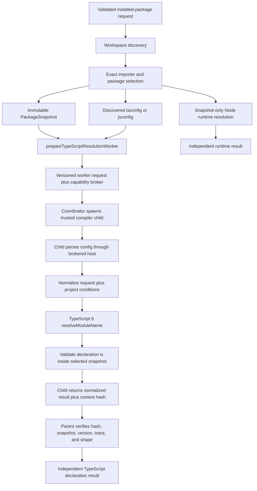

# Fresh Review Bootstrap

## Review Objective

Independently audit the Milestone 1.6 TypeScript declaration-resolution implementation for:

- fidelity to the approved M1.6 specification and ADR 0004;
- correctness of TypeScript declaration selection under importer and project context;
- separation of Node runtime resolution from TypeScript declaration resolution;
- containment, immutability, no-execution, process-isolation, and result-validation properties;
- protocol, lifecycle, cancellation, resource, and failure-normalization behavior;
- architecture and dependency direction;
- test quality, acceptance-criteria coverage, and documentation accuracy;
- maintenance cost and suitability as the compiler boundary reused by M1.7.

The reviewer must reconstruct the result from repository evidence. The Author Explanation later in
this document is testimony to verify, not a readiness recommendation.

Observable success means one exact installed or linked package snapshot can yield a deterministic,
package-relative declaration target under an explicit importer, lookup kind, and applicable project
configuration without executing inspected code or granting the compiler ambient workspace reads.
Expected unsupported, invalid, missing, malformed, limited, cancelled, and isolated-process cases
must fail through bounded project-owned results.

## Repository And Worktree

| Item | Frozen value |
| --- | --- |
| Repository | `dills122/package-spelunker` |
| Local path | `/Users/dsteele/repos/package-spelunker` |
| Pull request | Draft PR [#9](https://github.com/dills122/package-spelunker/pull/9) |
| Base branch | `main` |
| Feature branch | `codex/typescript-declaration-resolution` |
| Implementation base | `fc824e3e38569b240235e52bfcae83874d72b597` |
| Implementation head | `2ef77e2add4d0f25c4b91fcdf358188f4846e0df` |
| Freeze date | 2026-08-14, America/Toronto |
| Freeze platform | Darwin arm64 |
| Node | `v22.22.1` |
| pnpm | `10.23.0` |
| Dirty state at freeze | Clean; branch matched `origin/codex/typescript-declaration-resolution` |

Resolve the implementation diff with the exact immutable range:

```sh
git diff --stat fc824e3e38569b240235e52bfcae83874d72b597..2ef77e2add4d0f25c4b91fcdf358188f4846e0df
git diff --name-status fc824e3e38569b240235e52bfcae83874d72b597..2ef77e2add4d0f25c4b91fcdf358188f4846e0df
git diff fc824e3e38569b240235e52bfcae83874d72b597..2ef77e2add4d0f25c4b91fcdf358188f4846e0df
```

The frozen implementation range changes 52 files with 4,542 additions and 142 deletions. This audit
document and any later review-metadata-only commits are outside the implementation range and must
not silently expand it.

## Base, Head, Branch, And Dirty State

The implementation begins immediately after merged PR #8, which completed snapshot-only Node
runtime resolution. The feature branch contains these commits, oldest first:

| Commit | Purpose |
| --- | --- |
| `bf798ba` | Propose and source the TypeScript declaration-resolution design. |
| `e0dc387` | Correct the unreleased v1 TypeScript request/result contract. |
| `861d741` | Normalize one lookup kind and custom conditions. |
| `fe1c3a3` | Pin the TypeScript 6 compatibility compiler. |
| `a362882` | Resolve declarations through a supplied virtual host. |
| `6114b26` | Define the isolated compiler worker protocol. |
| `22e8cba` | Tighten virtual broker-path containment. |
| `fa5cee8` | Bound compiler worker frames. |
| `563b2aa` | Implement compiler child-process lifecycle isolation. |
| `982cb72` | Parse TypeScript project configuration through the virtual host. |
| `a0a1392` | Apply project config and conditions inside the compiler child. |
| `542525a` | Discover `jsconfig.json` as well as `tsconfig.json`. |
| `c94de0c` | Broker immutable package/workspace context and add integration coverage. |
| `1e3045f` | Reconcile canonical M1.6 documentation and handoff. |
| `aaeeb12` | Fix review-discovered validation and failure-boundary defects. |
| `43a0497` | Record final local verification evidence. |
| `2ef77e2` | Link draft PR #9 from the durable handoff. |

Before reviewing, verify that both hashes exist and that no implementation commits are omitted or
silently added. If the checked-out branch has advanced, continue to use the frozen range unless the
author explicitly refreshes this packet.

## In-Scope Commits And Paths

### Contracts and serialized examples

- `packages/contracts/src/inspect-installed-package-request-v1.ts`
- `packages/contracts/src/installed-package-investigation-v1.ts`
- focused contract tests under `packages/contracts/test/`
- `docs/contracts/v1/README.md`
- `docs/contracts/v1/installed-success.example.json`

### Compiler-backed resolution engine

- `packages/typescript-resolution/package.json`
- `packages/typescript-resolution/src/conditions.ts`
- `packages/typescript-resolution/src/config.ts`
- `packages/typescript-resolution/src/resolver.ts`
- `packages/typescript-resolution/src/index.ts`
- all focused tests and package documentation under `packages/typescript-resolution/`

### Isolated compiler process and filesystem broker

- `packages/worker-typescript/src/protocol.ts`
- `packages/worker-typescript/src/frame.ts`
- `packages/worker-typescript/src/coordinator.ts`
- `packages/worker-typescript/src/child.ts`
- `packages/worker-typescript/src/context.ts`
- `packages/worker-typescript/src/context-hash.ts`
- `packages/worker-typescript/src/index.ts`
- worker fixtures, focused tests, package metadata, and package documentation

### Workspace configuration discovery

- `packages/workspace-model/src/workspace-context.ts`
- the added `tsconfig.json`/`jsconfig.json` tests in
  `packages/workspace-model/test/workspace-context.test.ts`

### Workspace and dependency configuration

- `pnpm-lock.yaml`
- root `tsconfig.json`
- new TypeScript project references and package dependencies

### Canonical design and status documentation

- `docs/specs/typescript-declaration-resolution.md`
- `docs/research/typescript-declaration-resolution.md`
- `docs/architecture.md`
- `docs/security-model.md`
- `docs/implementation-plan.md`
- `docs/roadmap.md`
- `docs/handoff.md`
- `fixtures/matrix.md`
- root `README.md`

## Canonical Requirements And Plan

Read these before implementation details, in this order:

1. Repository instructions: [`../../AGENTS.md`](../../AGENTS.md).
2. Approved M1.6 specification:
   [`../specs/typescript-declaration-resolution.md`](../specs/typescript-declaration-resolution.md).
3. Compiler/version research:
   [`../research/typescript-declaration-resolution.md`](../research/typescript-declaration-resolution.md).
4. Architecture boundaries: [`../architecture.md`](../architecture.md).
5. Security invariants: [`../security-model.md`](../security-model.md).
6. Resource policy and process decision:
   [`../decisions/0004-first-slice-resource-policy.md`](../decisions/0004-first-slice-resource-policy.md).
7. Task M1.6 and adjacent M1.7–M1.9 sequencing:
   [`../implementation-plan.md`](../implementation-plan.md).
8. Executable acceptance inventory: [`../../fixtures/matrix.md`](../../fixtures/matrix.md).
9. Current continuation state: [`../handoff.md`](../handoff.md).

The four owner-approved material gates are:

1. use the Package Spelunker-pinned TypeScript 6 compiler, not workspace code or the unstable
   TypeScript 7 API;
2. bring the minimum M1.8 child-process/filesystem boundary forward into M1.6;
3. correct the unreleased v1 TypeScript contract around lookup kind, conditions, config, and mode;
4. keep declaration success single-artifact and reject outside-artifact redirects.

The final M1.6 delivery task remains unchecked in the specification because a genuinely
fresh-context independent review is intentionally still pending.

## Explicit Exclusions

Do not treat these as required M1.6 implementation unless the code accidentally claims them:

- public symbol traversal or normalized TypeScript API modeling; that is M1.7;
- completion of the entire general M1.8 worker milestone; M1.6 brings forward only the minimum
  reusable declaration-resolution boundary;
- application/core workflow composition and public result-envelope assembly; that is M1.9;
- CLI or MCP transport behavior;
- registry downloads, cache behavior, remote fallback, or any network provider;
- workspace compiler/plugin execution or version emulation;
- Bundler, Node10/classic, Yarn Plug'n'Play, or Bun-specific resolution;
- multi-artifact declaration success through `@types`, paths aliases, or another package;
- TypeScript type checking, diagnostics presentation, public symbol graphs, or semantic API diff;
- package publication metadata decision D1.

Pre-existing code outside the frozen diff should be reported separately unless this change depends
on it, worsens it, or incorrectly claims to have completed it.

## Verification Commands Available To Reviewer

Run read-only checks in a clean checkout of the frozen head:

```sh
pnpm install --frozen-lockfile --offline
pnpm check:static
pnpm typecheck
pnpm exec vitest run packages/typescript-resolution/test
pnpm exec vitest run packages/worker-typescript/test
pnpm test
pnpm test:integration
pnpm build
git diff --check fc824e3e38569b240235e52bfcae83874d72b597..2ef77e2add4d0f25c4b91fcdf358188f4846e0df
```

Author-observed final results on Darwin arm64 were:

| Command | Observed result |
| --- | --- |
| `pnpm install --frozen-lockfile --offline` | Passed; lockfile current, no download. |
| `pnpm check` | Passed; 22 test files, 200 tests. |
| `pnpm test:integration` | Passed; 22 test files, 200 tests. |
| `pnpm build` | Passed. |
| `git diff --check` | Passed. |

Important qualification: `test`, `test:unit`, and `test:integration` currently invoke the same
unfiltered `vitest run --passWithNoTests` script. The integration command is not an independent
partition even though integration tests are present and executed. Linux CI results were not
observed in the authoring task and must not be inferred from the local Darwin run.

## Author Explanation Location Or Delivery Step

Stop here for the blind first pass. Inspect the requirements, diff, tests, dependency graph, and
boundary code first. Record preliminary findings before reading below the next horizontal rule.

---

# Author Explanation

## Intent And Success Criteria

### Problem being solved

Package Spelunker already discovers the exact importer-specific installed package, captures it into
an immutable snapshot, and resolves its Node runtime target. M1.6 adds the separate TypeScript
question: which declaration file does the project compiler select for this package and importer?

That distinction matters because a legitimate package can resolve runtime code and type declarations
to different files. The implementation must preserve both as independent authoritative facts rather
than guessing one from the other.

### Intended behavior after this change

Given:

- one approved workspace root;
- one exact importer;
- one safe bare/scoped package specifier and optional subpath;
- one exact installed or linked package selection;
- one completed immutable `PackageSnapshot`;
- exactly one TypeScript lookup kind, `import` or `require`;
- an explicit, discovered, or absent TypeScript/JavaScript project config;

the system can now:

1. discover `tsconfig.json` or `jsconfig.json` from the importer toward the workspace root;
2. normalize request and project conditions;
3. parse supported project metadata without using ambient compiler filesystem APIs;
4. run TypeScript 6 declaration resolution in a bounded child process;
5. serve selected-package bytes only from the immutable snapshot;
6. serve bounded, contained, memoized workspace resolution metadata through a broker;
7. accept only a selected-package-relative `.d.ts`, `.d.mts`, or `.d.cts` result;
8. return compiler/config/mode/condition/trace/snapshot/context evidence;
9. normalize expected and isolated-process failures without returning raw exceptions or absolute
   evidence paths.

### Success criteria claimed as implemented

- Conditional import and require type branches select different declarations.
- `types` and `typesVersions` participate through the official TypeScript resolver.
- Node16 and NodeNext project modes are supported; unsupported modes fail explicitly.
- Project custom conditions are merged deterministically with request conditions.
- A matching `paths` redirect outside the selected artifact does not become a false success.
- npm, pnpm store links, and linked workspace packages resolve through the same snapshot-backed
  production path.
- Node runtime and TypeScript declaration targets can intentionally diverge with evidence.
- No inspected package code is imported or executed.
- Compiler crash, timeout, cancellation, OOM, malformed output, context mismatch, and output/trace
  limit paths do not terminate the coordinator.

These are author claims for the reviewer to verify, not a final verdict.

## Plan-To-Implementation Traceability

| M1.6 plan item | Implementation evidence | Test evidence | Status and qualification |
| --- | --- | --- | --- |
| Approve compiler, sequencing, contract, and single-artifact gates | M1.6 spec and research docs | Documentation/static checks | Implemented and owner-approved. |
| Correct v1 request/result contract | `inspect-installed-package-request-v1.ts`, `installed-package-investigation-v1.ts` | Contract tests and golden JSON | Implemented before first release. |
| Establish minimum versioned compiler worker and broker | `protocol.ts`, `frame.ts`, `coordinator.ts`, `child.ts`, `context.ts`, `context-hash.ts` | Protocol, frame, coordinator, context tests | Implemented for declaration resolution; not a claim that all of M1.8 is complete. |
| Implement compiler-backed declaration resolution | `conditions.ts`, `config.ts`, `resolver.ts` | Resolver/config/condition tests | Implemented for Node16/NodeNext single-artifact results. |
| Expand npm, pnpm, linked-workspace, config, and divergence fixtures | workspace integration test plus checked-in fixture materializers | Three production-flow integration cases and execution sentinels | Implemented for the principal positive paths. Some semantic rows remain parser-level only; see gaps. |
| Reconcile docs, independently review, and deliver | canonical docs and this audit packet | Full local gate | Documentation and local gate complete; independent review pending. |

### Adjacent milestone accounting

- M1.7 remains unimplemented. There is no public symbol graph package in this diff.
- M1.8 remains open in the implementation plan because the minimum process/broker foundation was
  pulled forward, while public-symbol worker behavior and complete milestone acceptance remain
  future work.
- M1.9 remains unimplemented. There is no core application service composing all stages into the
  serialized public investigation envelope.

## Technical Approach And Flow

### End-to-end control flow



There is no current `core` function that executes this whole diagram as one public workflow. The
integration test composes the existing APIs directly to prove the intended future M1.9 path.

### Contract layer

`typescriptConditions` remains an array in the public v1 request, but the Draft 2020-12 schema now
requires exactly one `import` or `require` member. The public TypeScript success data records:

- package-relative declaration `target`;
- `compilerVersion`;
- relative or `null` `tsconfigPath`;
- `node16` or `nodenext` `moduleResolution`;
- explicit `lookupKind`;
- normalized `conditions`.

The richer inward worker result additionally carries:

- `snapshotId`;
- bounded structured resolution trace;
- trace usage;
- `projectContextHash`.

The inward fields are intentionally not all serialized in the public v1 stage yet because M1.9 owns
evidence assembly and public workflow composition.

### Compiler and condition policy

The analysis package pins `@typescript/typescript6@6.0.2`. Its locked compatibility implementation
reports TypeScript `6.0.3`, and successful results must report exactly that version.

`normalizeTypeScriptConditions`:

- rejects zero or two lookup kinds;
- separates compiler-owned `types`, `node`, `import`, `require`, and `default` from custom names;
- merges project and request custom conditions;
- deduplicates and sorts evidence deterministically;
- caps condition counts and lengths.

Manifest conditional-object insertion order remains TypeScript's semantic concern; sorted evidence
does not reorder the package JSON itself.

### Project-config parsing

`parseTypeScriptProjectConfig` uses the trusted TypeScript 6 APIs `readConfigFile` and
`getParsedCommandLineOfConfigFile` with a supplied `ParseConfigFileHost`. It does not pass `ts.sys`.

Supported retained options are:

- Node16/NodeNext module resolution;
- `baseUrl`;
- `paths`;
- `moduleSuffixes`;
- `resolvePackageJsonExports`;
- `preserveSymlinks`;
- project `customConditions`.

Contained relative config inheritance is exercised. Unsupported module-resolution families return
a fixed `unsupported_context`. Malformed config and unsafe/beyond-workspace normalized paths return
a fixed `malformed_artifact`.

If no config applies, the fixed inferred resolver policy is NodeNext with package exports enabled.
The resolver itself always supplies `allowJs: true` and `noEmit: true` to the compiler options.

`readDirectory` is intentionally empty in config parsing because M1.6 needs resolution options, not
a project program or source-file inventory.

### Declaration-resolution engine

`resolveTypeScriptDeclaration` calls the public TypeScript 6 `resolveModuleName` API with:

- the explicit safe package specifier;
- the exact virtual importer;
- Node16 or NodeNext compiler options;
- an explicit ESNext or CommonJS resolution mode derived from lookup kind;
- a custom `ModuleResolutionHost` that clamps every probe beneath virtual `/workspace`;
- trace callbacks around file, read, directory, listing, realpath, start, and selected decisions.

A compiler selection is accepted only when:

1. the selected path normalizes under virtual `/workspace`;
2. it is inside the declared selected package root;
3. it ends in `.d.ts`, `.d.mts`, or `.d.cts`;
4. the supplied host confirms the exact selected file exists.

Paths aliases, `@types`, or any other redirect outside the selected root become
`unsupported_context`. A JavaScript implementation file is not promoted into a declaration answer.

### Worker protocol and process lifecycle

The worker request and broker messages use closed TypeBox schemas. The request binds one operation
ID, snapshot ID, importer, package root, config path, project fallback options, normalized
conditions, and trace limit.

The coordinator starts:

```text
process.execPath --max-old-space-size=<lowered MiB> <compiled child.js>
```

with:

- working directory `/`;
- empty environment object;
- stdin/stdout/stderr plus two dedicated broker pipes;
- stderr drained and never returned;
- wall-time timer;
- cancellation listener and forced-kill grace timer;
- output-byte counter;
- strict result validator.

The child reads one bounded JSON request from stdin. TypeScript host calls are synchronous, so the
child writes length-prefixed requests to file descriptor 3 and synchronously reads responses from
file descriptor 4. The parent services those calls asynchronously and sequentially. Result JSON
uses stdout; lifecycle control does not share the broker framing channel.

The child is trusted Package Spelunker code plus the pinned compiler. This is process lifecycle and
memory isolation, not an OS sandbox. The Node process technically retains its normal runtime APIs;
security depends on the trusted child code exposing inspected workspace state only through the
custom host and never invoking network or package runtime modules.

### Snapshot and workspace broker

`prepareTypeScriptResolutionWorker` validates bounded context and checks the snapshot package name
matches the requested package name. It creates virtual paths beneath `/workspace`.

The broker treats two package roots as aliases for the same immutable bytes:

- the logical selection entry, such as `node_modules/fixture-pkg`;
- the canonical relative root, such as
  `node_modules/.pnpm/fixture-pkg@1.0.0/node_modules/fixture-pkg` or a linked workspace path.

For package paths:

- `fileExists` and `readFile` use only snapshot metadata and `snapshot.readFile`;
- live selected-package files are not reopened;
- directory topology comes from snapshot directories;
- `realpath` maps logical roots to the canonical virtual root.

For non-package workspace paths:

- paths are mapped from virtual `/workspace` into the approved root;
- existing paths are canonicalized through the shared containment policy;
- exact importer content and contained `.json` files may be read under byte budgets;
- other contained source candidates may be probed for existence so the resolver can detect an
  outside-artifact paths redirect, but their content is not returned;
- directory topology may be listed under an entry budget;
- selected-package canonical paths reached through the live workspace are refused;
- bytes, topology, realpaths, and absence are memoized per operation.

The `.json` admission rule is intentionally broader than only the initially selected config path so
TypeScript can follow contained config inheritance and package-based JSON config metadata. An audit
should assess whether this is the narrowest capability consistent with the intended semantics.

### Project-context hash

Parent and child independently hash the ordered sequence of validated broker operations, paths, and
responses using a domain-separated SHA-256 framing scheme. The parent accepts success only when the
child returns the same `projectContextHash`.

This hash proves agreement about observations actually made during that operation. It is not a hash
of the entire workspace and does not make separate first observations atomic. Package bytes are
already immutable; live workspace metadata can still change before its first memoized observation.

### Parent result validation

Success is accepted only if the child result has exact keys and valid bounded values for:

- declaration target and extension;
- exact compiler version `6.0.3`;
- relative/null config path matching the request;
- supported mode and lookup kind;
- snapshot ID;
- parent-verified context hash;
- sorted conditions containing the requested conditions;
- bounded recognized trace steps;
- trace usage matching actual trace length.

Failure output also requires exact keys and recognized fixed messages. Unknown fields such as a raw
`stack` convert the outcome to the coordinator's fixed `analysis_failed` result.

## Changed-Component Walkthrough

| Component | Current responsibility | Important review symbols |
| --- | --- | --- |
| `contracts` request | Require one TypeScript lookup condition. | `inspectInstalledPackageRequestV1Schema` |
| `contracts` result | Serialize compiler/config/mode/lookup/condition data. | `typescriptResolutionData` |
| `conditions.ts` | Normalize and freeze lookup/custom conditions. | `normalizeTypeScriptConditions` |
| `config.ts` | Parse supported JSONC project options through a virtual host. | `parseTypeScriptProjectConfig` |
| `resolver.ts` | Run TypeScript declaration selection and normalize trace/failures. | `resolveTypeScriptDeclaration`, `createCompilerHost` |
| `protocol.ts` | Define and validate closed worker and broker protocol v1. | `isTypeScriptWorkerRequestV1`, broker validators |
| `frame.ts` | Encode/decode bounded length-prefixed JSON frames. | `writeFrameSync`, `readFrameSync`, `FrameDecoder` |
| `coordinator.ts` | Spawn/terminate child, service broker, enforce lifecycle/output, validate result. | `runTypeScriptResolutionWorker`, `normalizeWorkerResult` |
| `child.ts` | Parse request, expose synchronous broker host, parse config, resolve declaration. | `main`, `createBrokerHost` |
| `context.ts` | Build production request and snapshot/workspace broker. | `prepareTypeScriptResolutionWorker`, `createWorkspaceBroker` |
| `context-hash.ts` | Hash parent/child broker observations identically. | `observeProjectContext` |
| `workspace-context.ts` | Discover explicit/nearest TypeScript or JavaScript config. | `discoverTsconfig` |
| contract tests | Prove one lookup kind and new serialized fields. | request/investigation v1 tests |
| resolver tests | Prove core compiler selection, redirects, containment, cancellation, trace limit. | `resolver.test.ts` |
| config tests | Prove JSONC, relative inheritance, modes, inferred config, malformed config. | `config.test.ts` |
| worker lifecycle tests | Prove real child, timeout, cancellation, output, OOM, crash, malformed/mismatched output. | `coordinator.test.ts` and fixtures |
| broker tests | Prove aliases, immutability, absence memoization, context hash, entry budget, identity checks. | `context.test.ts` |
| workspace integration | Compose discovery, snapshot, runtime resolver, real compiler child for npm/pnpm/link. | `workspace-integration.test.ts` |

## Decisions And Rejected Alternatives

### Pinned TypeScript 6 compatibility compiler

Chosen because it exposes the stable public compiler API needed for a supplied module-resolution
host. The root TypeScript 7 compiler remains build tooling only.

Rejected:

- workspace-local compiler: would import and execute untrusted project dependency code;
- TypeScript 7 unstable sync API: temporary surface and additional native-server/process behavior;
- handwritten resolver: high semantic drift risk for exports, `typesVersions`, conditions, and
  extension substitution;
- shelling out to `tsc --traceResolution`: unstable text parsing and poor virtual-host control.

### Child process before public symbol work

Chosen because JavaScript cannot enforce a hard lifecycle boundary around non-yielding in-process
compiler work. The same process/broker design is intended for M1.7.

Rejected:

- main-process compiler: timeout/cancellation cannot reliably terminate stuck work;
- worker thread as the default: weaker memory/process boundary for this policy.

### Single-artifact success

Chosen to keep provenance exact: a result can only claim a declaration physically present in the
selected immutable package snapshot.

Rejected for v1:

- treating a paths alias or `@types` result as if it belonged to the selected package;
- returning a successful second-artifact declaration without a multi-artifact result contract.

### Lazy memoized workspace observations

Chosen to avoid copying or scanning the entire workspace while still supporting config inheritance,
package metadata, and path-redirect detection.

Alternative not implemented:

- pre-capturing a complete immutable project-resolution snapshot. That would improve atomicity but
  needs a bounded admission model for potentially broad config/path graphs and could do much more IO.

## Invariants And Boundary Conditions

### Identity and provenance

- Every successful declaration result carries the exact `snapshotId` supplied to the worker.
- The prepared context requires snapshot package name to match the requested package name.
- Both logical and canonical package paths map to the same snapshot bytes.
- A successful target is relative to the canonical selected package root and present in the snapshot.

### No execution

- No inspected JavaScript or declaration file is imported, required, evaluated, or run.
- Workspace compiler and TypeScript plugins are never loaded.
- Test fixtures include execution sentinels and no lifecycle scripts are invoked.

### Filesystem containment

- Protocol paths are normalized absolute virtual paths beneath `/workspace`.
- Live workspace paths are canonicalized under the approved root before reads.
- Selected-package live paths are refused; package content comes from snapshot bytes.
- Resolver host probes that normalize outside virtual workspace are redirected to a rejected virtual
  path and cannot reach a live host.

### Determinism and immutability

- Package bytes are immutable snapshot copies.
- First live workspace observations, including absence, are memoized for the operation.
- Conditions and retained evidence are deterministic and frozen.
- Result traces, usage, and returned values are frozen in the coordinator process.

### Compatibility boundary

- Exactly TypeScript 6.0.3 semantics are claimed by this implementation.
- Supported project module resolution is Node16 or NodeNext only.
- Exactly one import/require lookup kind is required.
- Success is one declaration artifact only.

### Resource and lifecycle boundaries

Current defaults or ceilings used directly by this change include:

| Boundary | Value |
| --- | ---: |
| Initial worker request | 1 MiB |
| Broker file content | 8 MiB protocol maximum |
| Broker frame | 8,454,144 bytes |
| Workspace metadata file | 1 MiB |
| Aggregate workspace metadata read | 16 MiB |
| Workspace entries observed | 10,000 |
| Resolver trace steps | 10,000 |
| Child output | 8 MiB |
| Wall time | 60 seconds |
| V8 old-space ceiling | 768 MiB default |
| Cancellation grace | 2 seconds |

Callers may lower supported worker/broker values through inward APIs. They cannot raise them above
the implementation defaults through those APIs.

The V8 flag bounds old-space heap, not total process RSS or an operating-system cgroup. OOM and
abnormal termination normalize safely, but this is not a complete hard memory sandbox.

### Error and privacy boundary

- Expected errors use fixed project-owned messages.
- Raw compiler diagnostics, Node errors, stacks, stderr, and local absolute paths do not cross the
  accepted result boundary.
- Trace paths are virtual-workspace-relative.
- Malformed child success or tainted failure output becomes fixed `analysis_failed`.

## Verification Performed And Results

### Contract coverage

- accepts one TypeScript import or require condition;
- rejects missing or ambiguous lookup kind;
- accepts `tsconfigPath: null`;
- requires mode, lookup, and conditions on successful serialized TypeScript data;
- keeps schemas closed against unknown fields.

### Resolver and config coverage

- import selects `.d.mts` and require selects `.d.cts` conditional type branches;
- `typesVersions` selects a TypeScript 6 declaration;
- a paths redirect outside the snapshot is unsupported;
- compiler host calls remain beneath virtual `/workspace`;
- JavaScript-only package selection is not a declaration success;
- unsafe specifiers, cancellation, and trace limits return fixed failures;
- JSONC config, relative inheritance, custom conditions, baseUrl/paths/moduleSuffix parsing,
  Node16 derivation, no-config inference, bundler rejection, and malformed JSON are covered.

### Worker and broker coverage

- real child success through the broker;
- config-derived Node16/custom-condition behavior;
- unsupported project config;
- cancellation before start and during a running child;
- wall timeout and forced termination;
- output overrun;
- V8 memory exhaustion;
- crash, malformed JSON, snapshot mismatch, condition mismatch, and tainted failure output;
- frame aggregate overrun;
- logical/canonical package aliasing;
- workspace byte and absence memoization;
- project-context hash shape;
- directory/file distinction and directory-entry failure;
- snapshot/request name mismatch.

### Integration coverage

The production-facing API sequence is exercised for:

- npm package subpath: runtime `dist/feature.js`, declaration `dist/feature.d.ts`;
- pnpm store symlink: runtime `dist/index.js`, declaration `dist/index.d.ts`;
- linked workspace package: runtime `dist/index.js`, declaration `dist/index.d.ts`.

All three use workspace discovery, snapshot construction, Node runtime resolution, worker context
preparation, and the real compiler child. Each checks that its execution sentinel remains absent.

### Review defects already found and corrected

The authoring task's five-axis review found these issues before the frozen head:

- project configs omitting `moduleResolution` could be assigned the wrong supported mode;
- worker protocol validation allowed internally inconsistent condition sets;
- a live regular file could be reported as a directory;
- snapshot/request package identity was not compared at preparation time;
- child failure objects with unrecognized extra fields could still be normalized as a semantic
  resolver failure instead of an isolated analysis failure.

Commit `aaeeb12` contains the corresponding fixes and regression tests. A fresh reviewer should
verify the fixes rather than assuming their presence proves completeness.

## Risks, Tradeoffs, And Maintenance Costs

### Large review surface

The frozen diff is 52 files and more than 4,500 added lines. Incremental commits separate the layers,
but PR #9 is still a large cohesive change spanning contract, compiler semantics, process lifecycle,
filesystem capability, tests, and documentation. Review should proceed layer by layer rather than
sampling only the final integration test.

### Trusted child rather than OS sandbox

The compiler process has a restricted custom TypeScript host, empty environment, and neutral working
directory, but it is not seccomp-, container-, or cgroup-isolated. The design trusts the worker code
and pinned compiler not to use ambient Node filesystem/network APIs outside the supplied host.

### Lazy workspace consistency

Memoization makes repeated observations stable, but separate first observations are not one atomic
workspace snapshot. Concurrent mutation could yield a mixed yet accurately hashed project context.
The hash authenticates the observation transcript between parent and child; it does not prove a
single point-in-time workspace state.

### Broker capability breadth

Any contained `.json` path requested by the compiler may be read, and any contained workspace file
may be existence-probed. This enables config inheritance and outside-artifact redirect detection but
is broader than an allowlist of preselected files. Directory enumeration is also available beneath
the approved root under a budget.

### Additional coupling

`worker-typescript` now depends on `package-snapshot` for containment/bounded reads and on
`typescript-resolution` for semantics. Integration tests add development dependencies on workspace
discovery, Node resolution, and fixture packages. This matches the intended inward graph, but the
worker package now owns both process lifecycle and production snapshot/workspace broker assembly.

### Compiler-version maintenance

The compatibility package version and underlying compiler version differ (`6.0.2` wrapper,
`6.0.3` compiler). Parent result validation hard-codes `6.0.3`. Any dependency update must be an
intentional semantic and contract review, not routine lockfile churn.

### Duplicate validation logic

Package-specifier safety and several path/condition rules exist at public contract, workspace,
resolver, protocol, and coordinator boundaries. The duplication is defense in depth but increases
drift risk. Review whether the rules agree on length units, normalization, reserved conditions, and
accepted subpaths.

### Test runtime cost

Lifecycle tests spawn real processes, including deliberate timeout and OOM fixtures. This is useful
evidence but may be sensitive to slower Linux CI hosts. The default production wall limit is not
used for the short deterministic timeout fixture.

## Deviations, Deferrals, And Known Gaps

These points are intentionally disclosed for independent judgment:

1. **Fresh independent review is not complete.** This packet exists to perform it; the final M1.6
   delivery checkbox remains open.
2. **Linux was not observed in the authoring task.** The final gate passed on Darwin arm64 only.
3. **Integration scripts are not partitioned.** `test`, `test:unit`, and `test:integration` run the
   same full Vitest suite, so the two 200-test reports are duplicate executions, not distinct sets.
4. **Some claimed semantics lack dedicated end-to-end fixtures.** `typings`, successful
   `moduleSuffixes` selection, package-based config inheritance, `preserveSymlinks`, unmatched paths
   fallback, and worker-level `jsconfig.json` parsing are not each isolated in a production-flow
   test. Some are parsed or delegated to TypeScript and only indirectly covered.
5. **No explicit `@types` redirect fixture exists.** A generic paths redirect proves the
   outside-selected-artifact rejection, but the `@types` case is a stated policy without its own
   nearby test.
6. **Workspace broker limits do not retain exact public limit identity.** A workspace byte/entry
   budget exception becomes broker failure and ultimately fixed `analysis_failed`; it does not
   currently surface an ADR-named `resource_limit_exceeded` value. Review whether internal broker
   limits should map to `maxArtifactBytesRead`/`maxFilesVisited` or gain protocol vocabulary.
7. **Workspace metadata is not atomically captured.** See the lazy consistency tradeoff above.
8. **The context hash is transcript-based.** It binds observations actually made, not all files that
   could have affected a different resolution path.
9. **Memory isolation is V8-heap-oriented.** Total RSS and non-heap allocations are not hard-capped
   by the implementation alone.
10. **M1.8 is only partially advanced.** The worker request supports declaration resolution only;
    M1.7 symbol analysis will require a protocol extension or a second operation.
11. **No public core workflow exists yet.** Consumers must compose discovery, snapshot, runtime, and
    TypeScript worker APIs themselves until M1.9.
12. **Failure traces are success-oriented.** Semantic failures generally return fixed outcomes
    without a retained partial compiler probe trace; M1.9 still owns evidence policy for failed and
    partial stages.
13. **No performance profile or large real-package corpus was run.** The evidence is deterministic
    fixtures and bounded lifecycle tests, not ecosystem-scale measurement.

None of these disclosures predetermines severity. The independent reviewer should decide whether a
gap blocks M1.6, is a non-blocking follow-up, or is properly deferred by the approved boundary.

## Challenge Points For The Reviewer

Apply extra skepticism here without limiting the audit to these questions:

1. Does the virtual-host design truly prevent any inspected package or workspace dependency code
   from being loaded or executed by TypeScript?
2. Can TypeScript derive or request a path that bypasses `mapPackagePath`, `withinSelectedPackage`,
   protocol virtual-path validation, or the shared canonical containment checks?
3. Do pnpm and linked-workspace logical/canonical mappings always return the same snapshot bytes,
   including nested paths and realpath behavior?
4. Can a symlink, missing path, file/directory race, or concurrent workspace mutation cause live
   selected-package content to be read or a wrong artifact to be reported as selected?
5. Is the transcript hash computed in exactly the same order and encoding in parent and child, and
   can close/event ordering finalize it before the last broker observation?
6. Are result validators strict enough to prevent spoofed compiler version, config, conditions,
   snapshot, target, usage, trace, or failure semantics?
7. Are TypeScript defaults derived correctly when config specifies only `module`, only
   `moduleResolution`, neither, or an unsupported combination?
8. Does sorting custom-condition evidence preserve TypeScript manifest branch semantics in every
   supported case?
9. Are `paths`, `baseUrl`, `typesVersions`, conditional `types`, subpaths, and extension substitution
   actually delegated to TypeScript without a project-owned reimplementation that could drift?
10. Is accepting any contained `.json` read and broad existence/topology probing proportionate, or
    should the broker pre-admit a narrower project-context graph?
11. Should workspace broker byte/entry failures surface exact ADR resource-limit identities instead
    of `analysis_failed`?
12. Is `--max-old-space-size` sufficient for the security claim being made, or should the docs more
    narrowly describe it as a V8 heap ceiling?
13. Does the protocol need an explicit broker timeout separate from total worker wall time?
14. Are frame buffering, stream backpressure, broker queue ordering, child close handling, and forced
    termination free of deadlock or unbounded memory cases?
15. Are the existing tests failure-sensitive, or could implementation shortcuts still pass because
    assertions use partial object matching?
16. Which specification claims currently exceed direct test evidence, especially `typings`,
    `moduleSuffixes`, package-based config inheritance, `@types`, and `jsconfig` end-to-end behavior?
17. Does adding `package-snapshot` capability logic to `worker-typescript` preserve the intended
    architecture, or should broker construction belong to a future core package?
18. Is the 4,500-line PR reviewable as one change, or should any layer be independently merged or
    audited before the rest?

Use `$independent-review` in reviewer mode. Work from the Fresh Review Bootstrap first and record a
preliminary review before reading the Author Explanation. Then verify the explanation against the
repository, review both the implementation and its plan, run proportionate non-mutating checks, and
return an evidence-backed verdict. Do not implement fixes.
